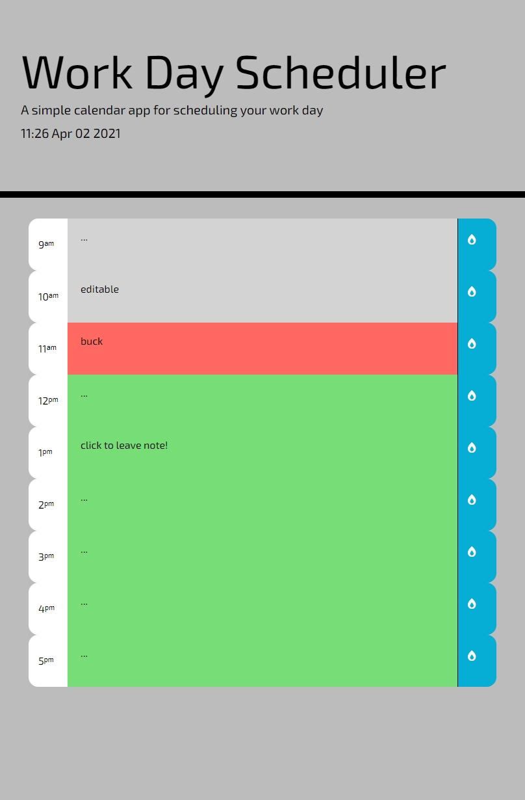

# Work Day Scheduler

Starter code copied from [here](https://github.com/coding-boot-camp/super-disco).
Repo is [here](https://github.com/japankid-code/day-scheduler).
Site is deployed [here](https://japankid-code.github.io/day-scheduler/).

## basic outline of functionality

the current day is displayed at the top of the calendar

scrolling down presents time blocks for standard business hours

each block is color-coded to indicate whether it is in the past, present, or future
click into a time block, can enter an event
clicking save button for time block, the text from that event is saved in localStorage
refreshing the page the saved events persist

### preview of site

### mockup image

